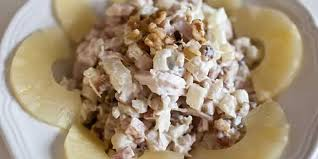

### This is a LOCAL change :)
# recipe
line 2 changed remotely
# Inna's Russian Chicken, Mushroom, and Pineapple Salad
### Recipe from Inna's mom

A Russian salad good on toasted bread and crackers. Generally served *cold*, the receipe is easy to make.  

last line changed locally

**Things to Note (Ordered List)**
1. It will take about **1.5 hours** to complete the list
2. Different *shapes* of pineapples can be used
3. Make a **cocktail** or **mocktail** out of the extra pineapple juice!
4. Add seasonings and taste as you go

**Helpful Tips (Unordered List)**
- Skim off the fat from the water after the chicken is done boiling
- To make the dish faster, *mix* the chicken with the mayo prior to putting the layers in
- **Siracha sauce** or **pepper flakes** goes well with the dish
- Don't be afraid of adding *too much* mayo

### This is a REMOTE change :O
